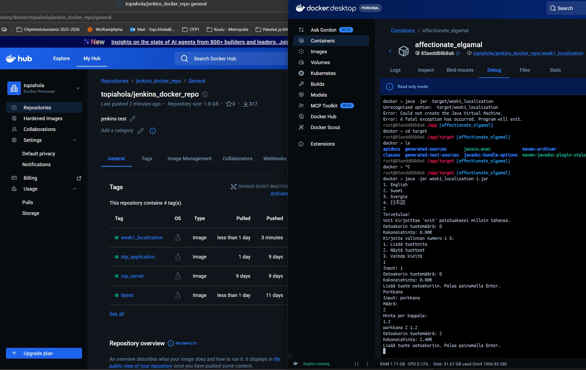
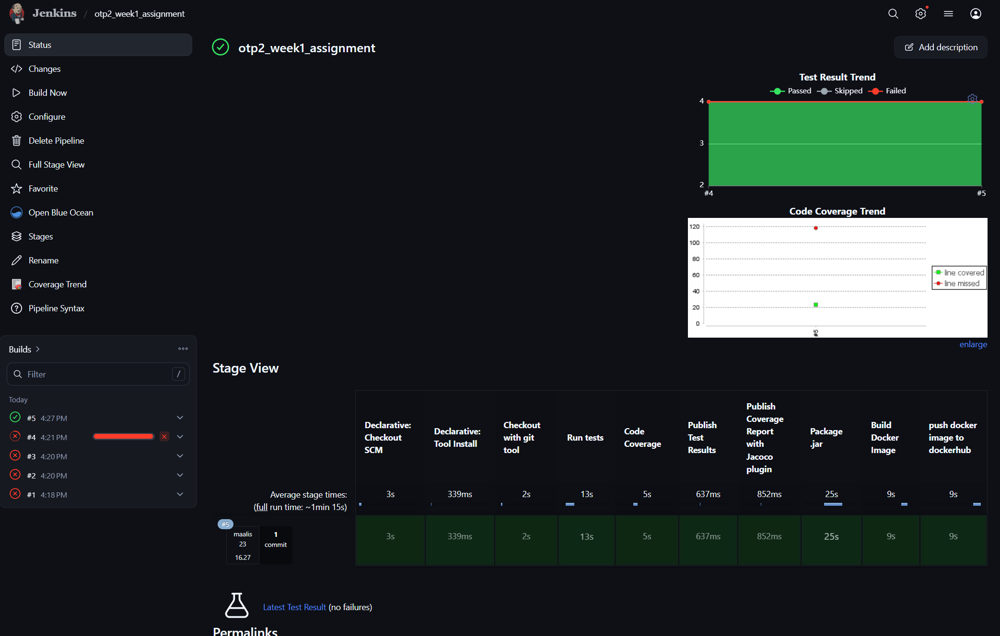

### Week1 assignment

1. GitHub Repo Link: Submit the URL to your GitHub repository containing all the project files.

2. Screenshot of Lab Demo Execution: Submit a screenshot (preferably as a PDF) demonstrating the
   successful execution of your image. Make sure your name has appeared in the screenshot, example (Amir
   Dirin). If your Docker Hub repository includes your account name (e.g., amirdirin/myimagerepo) in the
   screenshot, you do not need to add your name separately.

Screenshot of image pushed to DockerHub and running in a container

Screenshot of Jenkins pipeline
