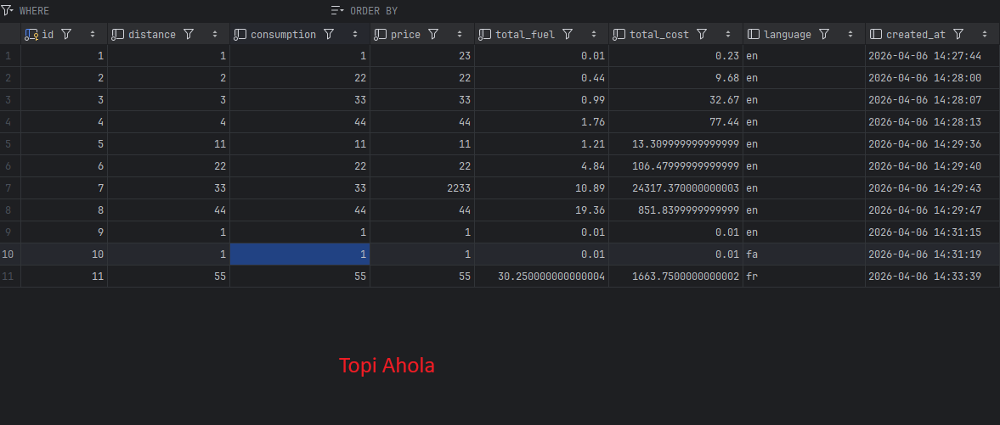

## OTP2

## Week 3: Database Localization Assignment with Database  

### Setting up the database

#### 1. init.sql
The database is created with the init.sql file. The user for the database has to be created separately. init.sql inserts data into the database as well.

 

#### 2. Environmental variables
The application and database have to be run in an environment where following environmental variables are defined.
USER and PASSWORD have to be working user credentials for the database.

    Variable: default value 
    DB_DRIVER: "jdbc:mariadb" 
    DB_HOST: "localhost" 
    DB_PORT: "3306" 
    DB_NAME: "otp2_week3" 
    USER: "databaseuser"
    PASSWORD: "password"

 

#### 3. Setting up with docker-compose

Note: when setting up in Docker containers the DB_HOST variable has to be set dynamically by docker-compose to point to the container running the database, here named **datab**.

USER and PASSWORD variables have to match MARIADB_USER and MARIADB_PASSWORD set by the compose file 

The application container wains for database containers health check.

      datab:        
        image: mariadb:latest
        container_name: week3_database
        restart: always
    
        environment:
          MARIADB_ROOT_PASSWORD: "rootpassword"
          MARIADB_DATABASE: "otp2_week3"
          MARIADB_USER: "databaseuser"
          MARIADB_PASSWORD: "password"
    
        #test if database actually ready
        healthcheck:
          test: [ "CMD", "healthcheck.sh", "--connect", "--innodb_initialized"]
          start_period: 10s
          interval: 5s
          timeout: 20s
          retries: 4

        ports:
          - "3306:3306"
        volumes:
          - db_data:/var/lib/mysql #remove this?
          - ./init.sql:/docker-entrypoint-initdb.d/init.sql #sql file for db initialization
          - ./my.cnf:/etc/mysql/conf.d/my.cnf:ro   #config file
    
    
      application:
        image: otp2_week3:latest
        container_name: week3_application
        depends_on:
           datab:
             condition: service_healthy

        environment:
          #for Xming display output
          DISPLAY: host.docker.internal:0
    
          DB_DRIVER: "jdbc:mariadb"
          DB_HOST: datab
          DB_PORT: "3306"
          DB_NAME: "otp2_week3"
          USER: "databaseuser"
          PASSWORD: "password"
    
    
<figure>
<figcaption>Picture of database table</figcaption>

</figure>

### Submission Requirements 
1. GitHub Repository Including: 
• Source code (Java files, FXML, CSS) 
• Database schema file (schema.sql) 
• Dockerfile 
• Jenkinsfile 
• docker-compose.yml (optional) 
• README with setup instructions 

2. Screenshots Showing: 
• calculation_records table shows at least 3 calculation records with distance, consumption, price, 
total_fuel, total_cost, language, timestamp 
• localization_strings table showing key-value pairs for all four languages (EN, FR, JP, IR) 
• Application screenshots with all four languages (EN, FR, JP, IR) showing calculations 
• Include your name tag in all screenshots 

3. Database Configuration: 
• Provide clear instructions for setting up the database in README 
• Document database connection configuration requirements 
• Include sample data insertion script (optional but recommended)